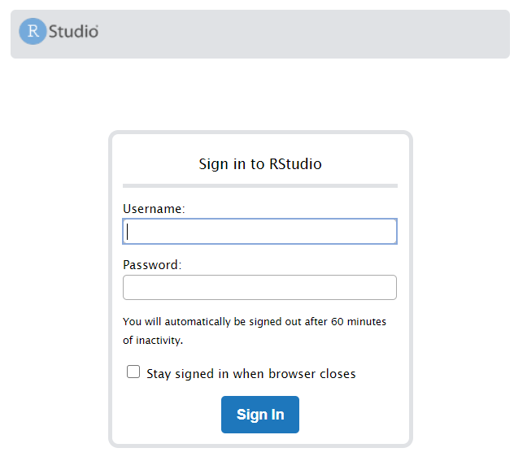
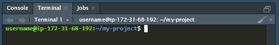

# Pre-mat workshop quick start

This guide will help you get started with RStudio Server and set up your 
first R project in GitHub.

## Getting started with rstudio server

In order to avoid every student having to install `R` themselves and deal with
operating-system-specific issues, we have set up RStudio Server 
and given each student access. If you are unfamiliar with `R` or RStudio, take 
some time to familiarize yourself with each. 

Once you are ready, navigate to the URL you were provided with. This screen
should appear: 



Enter the username and password you were given at the start of the workshop.
This will start an RStudio session in your browser. If it worked, you should
see your home screen:


The only difference between using RStudio Server and RStudio (besides 
the fact that one is in a browser...) is that your scripts, packages, and data 
are stored on the cloud computer instead of your personal computer. 

To get files onto the cloud computer you can:
1. Upload the files from your personal computer using the 'Upload' button in
the right-hand 'files' panel.
2. Use RStudio's built-in 'Terminal' to download files via linux shell commands:
```
wget https://raw.githubusercontent.com/millerh1/premat-workshop/master/README.md
```
3. Use R commands to download files:
```
download.file(url="https://raw.githubusercontent.com/millerh1/premat-workshop/master/README.md",
              destfile="README.md")
```
4. For advanced users, consider using ssh to access the linux server directly. 
Your username and password are the same which you used to login to RStudio Server. 


## Setting up a project and adding it to GitHub

As part of this workshop students will complete a short project. You can choose
any project you would like as long as it involves analyzing a dataset and 
reporting the results using `R`. An example project has been provided here under
`SARS-CoV-2 project/`.

To set up a project in RStudio, click the `Project` button and follow the prompts
to create the project directory. While it is not required to make an RStudio 
project, there are many benefits to doing so. Chief among these is that you 
can move the project folder to any location or to any computer and the 
scripts inside it will still work correctly. 

The next step is to initialize your project with `git`. `git` is a versioning
system for coding projects. When you make changes to your code, you will 'commit'
the changes to the `git` repository and then push these changes to GitHub. 

1. Open the 'Terminal' in RStudio:



2. At this point you should be inside your project directory if you followed 
the RStudio project directions. Now we initialize this project as a `git`
repository. Type this command into the terminal and hit 'Enter':
```
git init
```
This is the output if successful:
```
Initialized empty Git repository in /home/username/my-project/.git/
```
3. Now we create some content by entering this in the terminal:
```
echo "# Hello World!" > README.md
```
4. Add the new project files to the `git` repo:
```
git add .
```
5. Tell `git` which kinds of files to ignore:
```
echo ".Rproj.user" > .gitignore
```
5. Configure your author information with this repository:
```
git config user.email "millerh1@livemail.uthscsa.edu"
git config user.name "Henry Miller"
```
6. Commit your changes to the repository:
```
git commit -m "My first commit!"
```

The next step is to add the project to GitHub. GitHub is a central repository
for computer code and serves as both a convenient storage space for data, 
a nexus for collaborations, and a resume of your past projects and coding sklls.
For this workshop you will create a GitHub account and push your `git` repository
there.

1. Create a GitHub account using your school email. 
2. Create a new repository in GitHub (don't bother adding a `README`)
3. Link this remote GitHub repository with your local `git` repository 
by typing the following into the terminal:
```
git remote add origin https://github.com/millerh1/my-project.git
```
4. Push the changes your commited earlier to GitHub:
```
git push -u origin master
```
5. Refresh your GitHub page -- if this worked it should now say "Hello World!" 
in the README.

Now that you have successfully set up your GitHub repository you are free to 
start coding. Anytime you make some significant changes it is good practice 
to commit these changes to GitHub:
```
git add .
git commit -m "a description of the changes I made"
git push -u origin master
```

When you finish your analysis return to the `README.md` file and start documenting
what you did. `.md` files are written in `markdown`. For a guide on how to write
in this language, check out this [tutorial](https://guides.github.com/features/mastering-markdown/).

To see an example of a completed project, check out the `SARS-CoV-2 project/` folder. 


