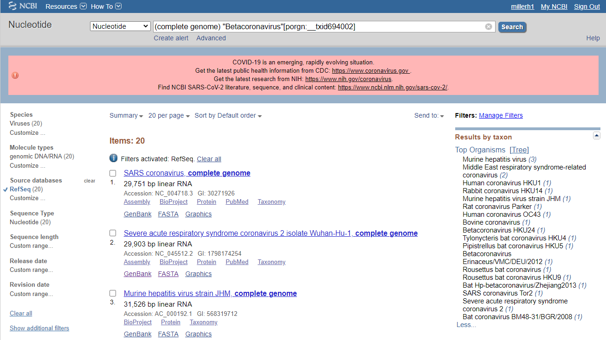
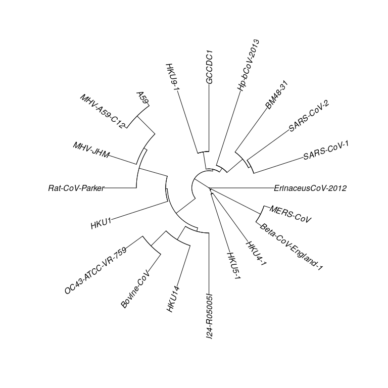

# Phylogenetic analysis of SARS-CoV-2

SARS-CoV-2 is a novel coronavirus which emerged from Wuhan, China in
late 2019. While much is known about SARS-CoV-2, it is still unclear how
this virus differs from other coronaviruses. To address this gap in
knowledge I will:

1.  Obtain SARS-CoV-2 sequence submitted to the NCBI along with other
    coronaviruses
2.  Use multiple sequence alignment to compare them
3.  Calculate phylogenetic distance and visualize the results

Obtaining coronavirus sequences
-------------------------------

I started by finding the taxonomy ID number for the *betacoronavirus*
genus using the NCBI taxonomy browser. I then used that taxonomy ID to
search for all the betacoronavirus genus RefSeq genomes available from
NCBI. I selected the option to download these sequences as a `.fasta`
file.

Using multiple sequence alignment to compare coronavirus genomes
----------------------------------------------------------------

Multiple sequence alignment (MSA) is a fundamental bioinformatics
technique which involves comparisons of multiple gene sequences. To
perform MSA, I used the `msa` package.

### Initial alignment of CoV genomes

I began my analysis by reading the sequences from the `.fasta` file with
the `readDNAStringSet` command.

    suppressPackageStartupMessages(library(msa))
    sequences <- readDNAStringSet("sequences.fasta")
   

Because these sequences are derived from NCBI, they are labeled in an
official and unreadable way. We can add some human-readable names to
help with visualizing the results:

    names(sequences) <- c("SARS-CoV-1", "SARS-CoV-2", "MHV-JHM", "HKU1", "A59",
                             "OC43-ATCC-VR-759", "ErinaceusCoV-2012", "Beta-CoV-England-1", "GCCDC1", "HKU24-R05005I",
                             "Hp-bCoV-2013", "MERS-CoV", "HKU14", "BM48-31", "Rat-CoV-Parker",
                             "HKU9-1", "HKU5-1", "HKU4-1", "Bovine-CoV", "MHV-A59-C12")

It isn’t possible to easily visualize a multi-Kb full-genome MSA, but a
small subset is easier to interpret. I started the analysis process by
subsetting the first 100 base pairs of each sequence and aligning them
with `msa`. Finally I rendered the alignment results as a PDF:

    sequences_small <- subseq(sequences, 1, 100)
    dev.null <- capture.output({ # This wrapper prevents print statements
      small_alignment <- msa(sequences_small)
    }) 
    msaPrettyPrint(small_alignment, output = "pdf", askForOverwrite = FALSE,
                 file = "misc/short_alignment.pdf", paperWidth = 22)

### Full-length MSA of CoV genomes

The full-length MSA took around 45 minutes to finish. To avoid losing my
results and having to run the alignment again, I saved the output of the
`msa` command as an `.rda` file using the `save` command.

I also included a little bit of `if...else` logic such that if the
alignment has already been run, the file will be loaded with the `load`
command and alignment will not be run again.

    if (! file.exists("alignment_results.rda")) {
      alignment <- msa(sequences)
      save(alignment, file = "alignment_results.rda")
    } else {
      load("alignment_results.rda")
    }

MSA creates a ‘consensus sequence’ that represents conservation of
sequence similarity between genomes. Consensus sequences contain
special characters which are coded based on MSA results. A useful guide
is found
[here](https://zhanglab.ccmb.med.umich.edu/FASTA/#:~:text=FASTA%20format%20is%20a%20text,by%20lines%20of%20sequence%20data.).

    paste0("Consensus sequence: ", substr(consensusString(alignment), 500, 1000))

    ## [1] "Consensus sequence: TVKYBKYSTTSYWRMWYYRK-WRRADKGMKKYRTKMMGYMTSYYMYARKMCSTSRTRTTTWYSTSRWTRARRRK-----MYHBAKRRTRYGKAKSYSBWAMYWHWVAWGGYWDWSMARTYSSSTDRTGSMGYTTKGGKYARRYSAYSMHRKSRYWYGYHHHDBYMKGCATGGTRWRMCWBDKGKKKTBTTCYTMMMRBWTSRKSCAYRRSWTKKYWYHRGCRYTACYRYSWRTRTWMHACTRCGTARGWRYGSTDDTRRYGSMSAYGKBKCCYAYSARYTYYHYWYSRWYSWAMC--RTGRTRYVTBYYWKGGTRMDRGYCKTKTYRYDGRYYSKWTYGWWSMWTTYVMDGMBRWDYSKRAKKVTRMRHAKSMSHRKDKKSWDCYYWRGRABHTSHWTYTKSRKMAKRRYGGWRRYRAWKKBWYTYBSWMWDYYGRYCAMWWCHKSYGYGSYSYWRWYRKKMMWSYKHWTRRYKKYWWWGTAGAKKWWGYTKVYRAGGMKG"

Phylogenetic comparison of CoV genomes
--------------------------------------

Finally, I used the `seqinr` and `ape` packages to calculate
phylogenetic distance between our betacoronavirus species and visualize
the results as a dendrogram.

    suppressPackageStartupMessages(library(seqinr))
    suppressPackageStartupMessages(library(ape))
    alignment_seqinr <- msaConvert(alignment, type="seqinr::alignment")
    d <- dist.alignment(alignment_seqinr, "identity")
    tree <- nj(d)
    plot.phylo(tree, type = "fan")

As expected, we can see that SARS-CoV-2 is most similar to SARS-CoV-1.
Interestingly, both SARS strains are also similar to BM48-31, a bat CoV
originating from Bulgaria. Previous studies showed that BM48-31 did not
have SARS-CoV-1 surface antigens. However, there were unanticipated
similarities in other protein domains:

> However, the receptor binding domain of SARS CoV showed higher
> similarity with that of BtCoV/BM48-31/Bulgaria/2008 than with that of
> any Chinese bat-borne CoV. Critical spike domains 472 and 487 were
> identical and similar, respectively.

Drexler, J. F., Gloza-Rausch, F., Glende, J., Corman, V. M., Muth, D.,
Goettsche, M., Seebens, A., Niedrig, M., Pfefferle, S., Yordanov, S.,
Zhelyazkov, L., Hermanns, U., Vallo, P., Lukashev, A., Müller, M. A.,
Deng, H., Herrler, G., & Drosten, C. (2010). Genomic Characterization of
Severe Acute Respiratory Syndrome-Related Coronavirus in European Bats
and Classification of Coronaviruses Based on Partial RNA-Dependent RNA
Polymerase Gene Sequences. Journal of Virology.
<a href="https://doi.org/10.1128/jvi.00650-10" class="uri">https://doi.org/10.1128/jvi.00650-10</a>

Conclusion
----------

In this short project, I searched the NCBI database for the genomes of
betacoronaviruses, used `msa` to perform multiple sequence alignment,
and then used `ape` and `seqinr` to calculate phylogenetic distance and
visualize the results as a dendrogram.

I found that MSA-based analysis is robust for calculating phylogenetic
distance, evidenced by the similarity between SARS-CoV-1 and SARS-CoV-2
on the dendrogram. I also found that SARS CoV strains show unanticipated
similarity with BM48-31. While China is the source of both SARS strains,
BM48-31 originates from Bulgaria. Despite this great geographical
distance, SARS-CoV-1 and BM48-31 share nearly identical spike protein
domains 472 and 487. This unlikely similarity could have important
implications for our understanding of coronavirus genetics and the
evolutionary changes which may lead to future outbreaks.

