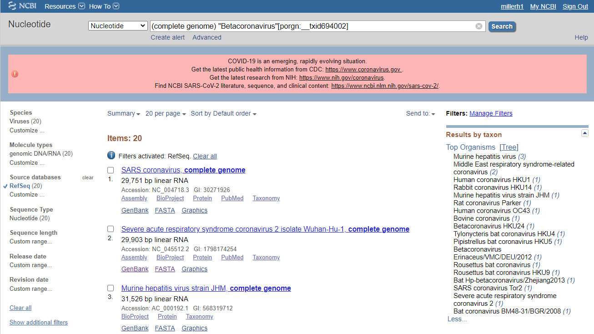

SARS-CoV-2 is a novel coronavirus which emerged from Wuhan, China in late 2019.
While much is known about SARS-CoV-2, it is still unclear how this virus
differs from those involved in previous pandemics. To address this gap in 
knowledge I will:

1. Obtain SARS-CoV-2 sequence submitted to the NCBI along with other coronaviruses
3. Use multiple sequence alignment to compare them
4. Visualize the results using a dendrogram

### Obtaining coronavirus sequences

I started by finding the taxonomy ID number for the *coronaviridae* family
using the NCBI taxonomy browser. I then used that taxonomy ID to search for
all the coronavirus family genomes available from NCBI. I also limited my search
to RefSeq genomes as these will be the 'official' sequence.




I selected the option to download these sequences as a `.fasta` file. 

### Using multiple sequence alignment to compare coronavirus genomes

Multiple sequence alignment (MSA) is a fundamental technique for bioinformaticians
in which gene sequences are compared across organisms. To perform MSA, I used 
the `msa` package:

```{r}
library(msa)
sequences <- readAAStringSet("sequences.fasta")
sequences
```


